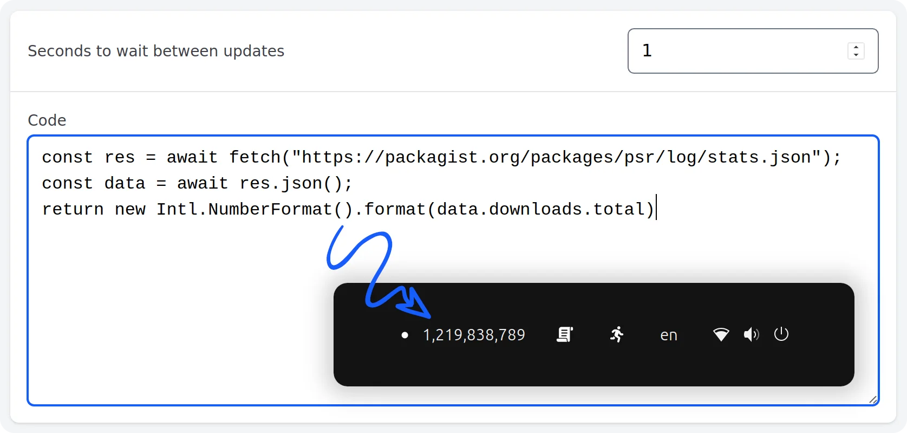

# Traybits

Bits of information fetched with javascript in the system tray.

<picture>
    <source media="(prefers-color-scheme: dark)" srcset="./media/screenshot-dark.webp" width="873">
    
</picture>

## Installation

Download the latest release from [Releases](releases) and run the executable.
The app is not signed, so you may need to allow it in your system settings.

### MacOS

 1. After you copied the app to the Applications folder, run the following command:

    ```bash
    xattr -c "/Applications/Traybits.app"
    ```

 2. Now, find "Traybits" in the Applications folder, right click on the App and
    choose "Open" in the context menu.

### Ubuntu

 1. Double click the downloaded `deb` file and install it.
 2. Run the app.

### Windows

I don't have a Windows machine to test the app. If you are on Windows and
want to use the app, please try to [build it](#developement) and let me know if
it works.

## Bits examples

### Packagist download count

```js
export default async () => {
  const res = await fetch("https://packagist.org/packages/psr/log/stats.json");
  const data = await res.json();
  return new Intl.NumberFormat().format(data.downloads.total)
}
```

### GitHub stars and issues


```js
export default async () => {
  const res = await fetch('https://api.github.com/repos/tauri-apps/tauri');
  const data = await res.json();
  return `★ ${new Intl.NumberFormat('en', {
    notation: 'compact',
    maximumFractionDigits: 0,
  }).format(data.stargazers_count)} ⚠ ${data.open_issues_count}`;
}
```

### Pomodoro timer


```
const pomodoro = (() => {
  const START = Date.now();
  return () => {
    const elapsed = Math.floor((Date.now() - START) / 1000);
    const remaining = Math.max(0, 25 * 60 - elapsed);

    const minutes = Math.floor(remaining / 60);
    const seconds = remaining % 60;

    if (!minutes && !seconds) {
      return '☕️';
    }

    return `🍅 ${minutes}:${String(seconds).padStart(2, '0')}`;
  }
})();

export default async () => {
  return pomodoro();
}
```

### Football match score


```js
const TEAM = 'GER';
const FIFA_TO_ISO = {
  // Group A  // Group B  // Group C  // Group D  // Group E  // Group F
  MEX: 'MX',  CAN: 'CA',  BRA: 'BR',  USA: 'US',  GER: 'DE',  NED: 'NL',
  RSA: 'ZA',  BIH: 'BA',  MAR: 'MA',  PAR: 'PY',  CUW: 'CW',  JPN: 'JP',
  KOR: 'KR',  QAT: 'QA',  HTI: 'HT',  AUS: 'AU',  CIV: 'CI',  SWE: 'SE',
  CZE: 'CZ',  SUI: 'CH',  SCO: 'GB',  TUR: 'TR',  ECU: 'EC',  TUN: 'TN',

  // Group G  // Group H  // Group I  // Group J  // Group K  // Group L
  BEL: 'BE',  ESP: 'ES',  FRA: 'FR',  ARG: 'AR',  POR: 'PT',  ENG: 'GB',
  EGY: 'EG',  CPV: 'CV',  SEN: 'SN',  DZA: 'DZ',  COD: 'CD',  CRO: 'HR',
  IRI: 'IR',  KSA: 'SA',  IRQ: 'IQ',  AUT: 'AT',  UZB: 'UZ',  GHA: 'GH',
  NZL: 'NZ',  URU: 'UY',  NOR: 'NO',  JOR: 'JO',  COL: 'CO',  PAN: 'PA',
};

function flag(abbr) {
  if (!FIFA_TO_ISO[abbr]) {
    return abbr;
  }
  return FIFA_TO_ISO[abbr].replace(/./g, c => String.fromCodePoint(127397 + c.charCodeAt()));
}

export default async () => {
  const res = await fetch('https://site.api.espn.com/apis/site/v2/sports/soccer/all/scoreboard');
  const data = await res.json();
  const game = data.events?.find(event => {
    return event.competitions?.[0]?.competitors?.some(
      team => team.team.abbreviation === TEAM
    );
  });

  if (!game) {
    return '⚽';
  }

  const [home, away] = game.competitions[0].competitors;

  if (game.status?.type?.state === 'pre') {
    return [
      flag(home.team.abbreviation),
      new Date(game.date).toLocaleString(undefined, {
        month: 'numeric',
        day: 'numeric',
        hour: 'numeric',
        minute: 'numeric',
      }),
      flag(away.team.abbreviation),
    ].join(' ');
  }

  return [
    flag(home.team.abbreviation),
    `${home.score}:${away.score}`,
    flag(away.team.abbreviation),
  ].join(' ');
}
```

### Days till New Year

```js
export default async () => {
  const now = new Date();
  const newYear = new Date(now.getFullYear() + 1, 0, 1);
  return '' + Math.ceil((newYear - now) / 86400000);
}
```

## Developement

```
# run watcher
npm run tauri dev

# update icon
npm run tauri icon media/app-icon.png

# build binaries
npm run tauri build
```
