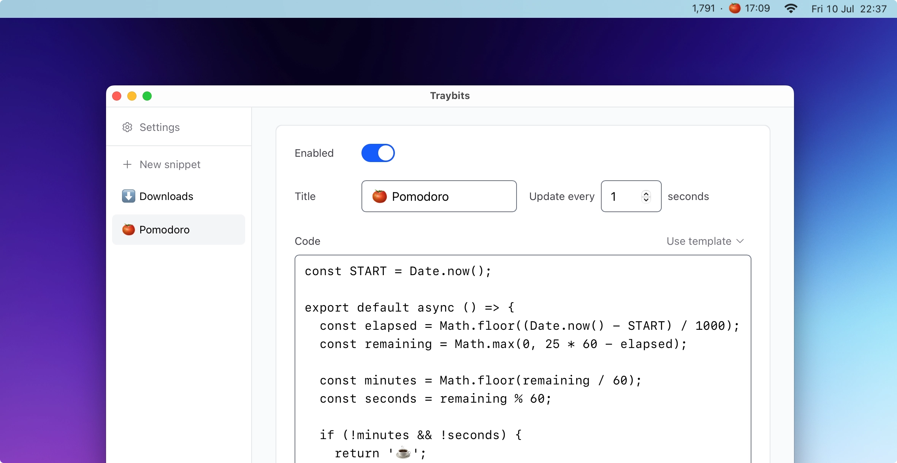
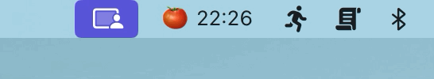

# Traybits

App to display various information in the system tray using javascript snippets.

<picture>
    <!-- <source media="(prefers-color-scheme: dark)" srcset="./media/screenshot-dark.webp" width="873"> -->
    
</picture>

## Installation

Download the latest release from [Releases](releases) and run the executable.
The app is not signed, so you may need to allow it in your system settings.

### MacOS

 1. After you copied the app to the Applications folder, run the following command:

    ```bash
    xattr -c "/Applications/Traybits.app"
    ```

 2. Now, find "Traybits" in the Applications folder, right click on the App and
    choose "Open" in the context menu.

### Ubuntu

 1. Double click the downloaded `deb` file and install it.
 2. Run the app.

### Windows

I don't have a Windows machine to test the app. If you are on Windows and
want to use the app, please try to [build it](#developement) and let me know if
it works.

## Snippets examples

### Packagist download count

```js
export default async () => {
  const res = await fetch("https://packagist.org/packages/psr/log/stats.json");
  const data = await res.json();
  return new Intl.NumberFormat().format(data.downloads.total)
}
```

### GitHub stars and issues


```js
export default async () => {
  const res = await fetch('https://api.github.com/repos/tauri-apps/tauri');
  const data = await res.json();
  return `★ ${new Intl.NumberFormat('en', {
    notation: 'compact',
    maximumFractionDigits: 0,
  }).format(data.stargazers_count)} ⚠ ${data.open_issues_count}`;
}
```

### Pomodoro timer



```
const START = Date.now();

export default async () => {
  const elapsed = Math.floor((Date.now() - START) / 1000);
  const remaining = Math.max(0, 25 * 60 - elapsed);

  const minutes = Math.floor(remaining / 60);
  const seconds = remaining % 60;

  if (!minutes && !seconds) {
    return '☕️';
  }

  return `🍅 ${minutes}:${String(seconds).padStart(2, '0')}`;
}
```

## Developement

```
# run watcher
npm run tauri dev

# update icon
npm run tauri icon media/app-icon.png

# build binaries
npm run tauri build
```
